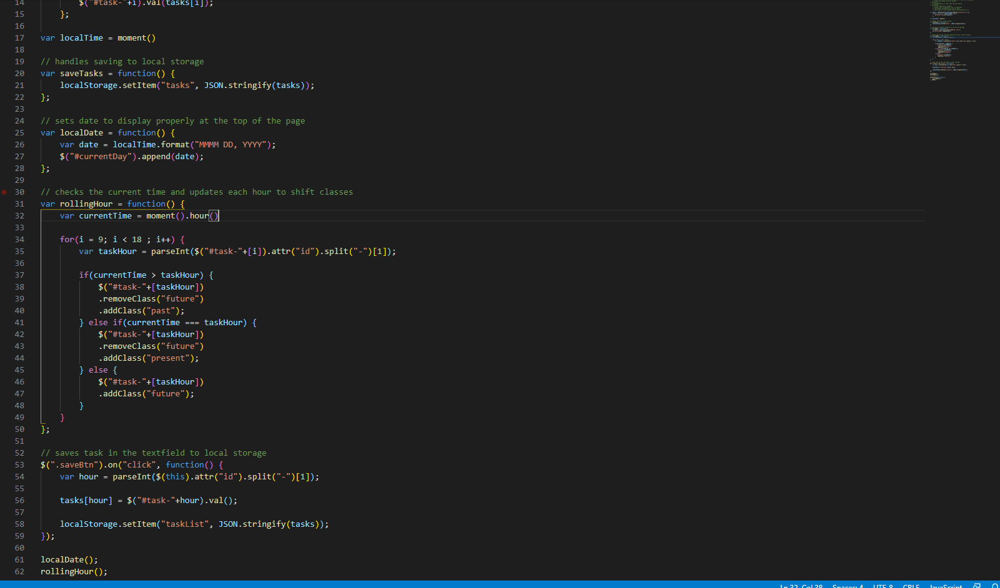
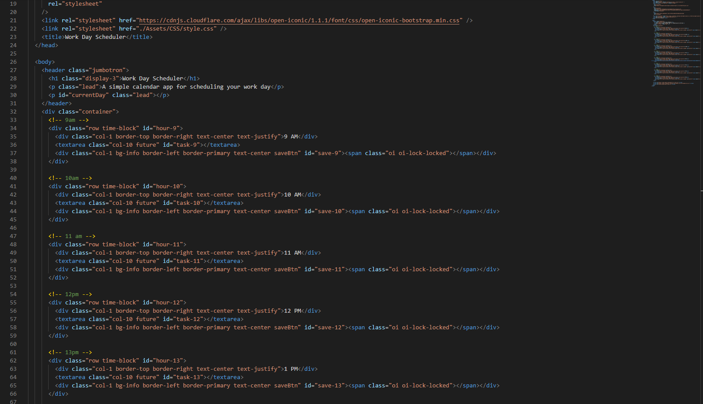
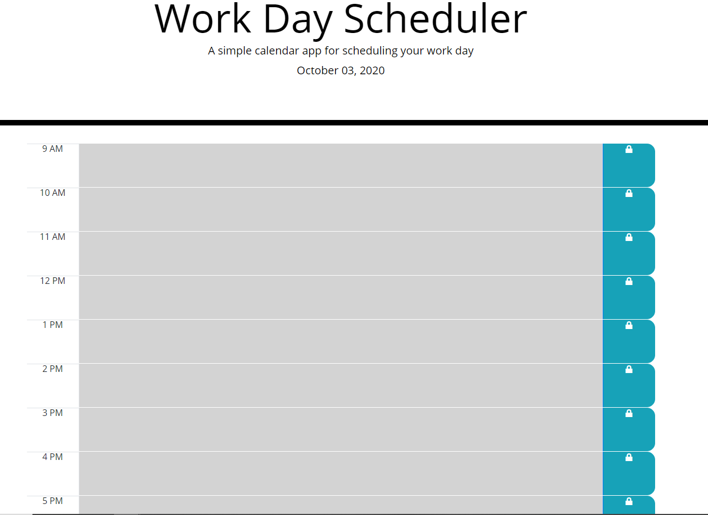

# Work Day Scheduler

## Description

This simple application records and stores any user generated tasks throughout a day. Tasks are saved to LocalStorage and as time passes throughout the day the time blocks will reflect the passage of time. Easy to use app that will keep you organized and on pace to finish everything you hope to accomplish during the course of the day.

Application borrows from jQuery, Bootstrap, Moment.js and Iconic icon library.

## Website

The live website can be found at https://uberbrent.github.io/workday-scheduler/

## Screenshots
Example screen of the live JS code:

Example of the live HTML code:

Example of the application start screen:

